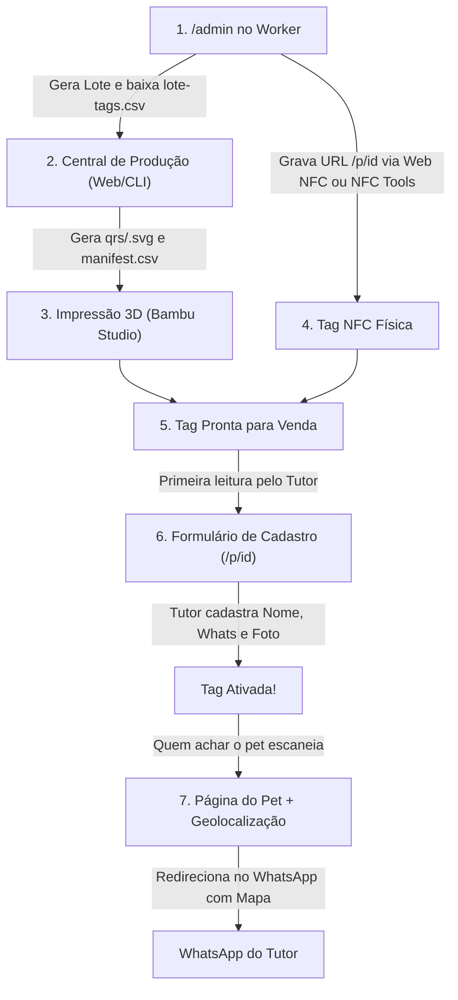

# 🐾 Sistema Pet NFC — Lote Pré-fabricado, Cadastro na Primeira Leitura & Central de Produção 3D

Solução completa de ponta a ponta para identificação inteligente de pets:
1. **Cloudflare Worker (Backend & Plataforma Web)**: Cadastro direto na primeira leitura (sem login/código), redirecionamento para WhatsApp com geolocalização de quem encontrou o pet, link de edição privado do tutor e painel `/admin` com Web NFC.
2. **Central de Produção 3D (Web na Vercel & Script CLI)**: Transforma o `lote-tags.csv` baixado no `/admin` em QR Codes vetoriais **SVG puros** (para **Bambu Studio**, PrusaSlicer e fatiadores 3D) e gera a planilha de controle `manifest.csv`.

---

## 🔄 Como Funciona o Ciclo de Vida da Tag



---

## ☁️ 1. Deploy do Cloudflare Worker (Backend & Sistema do Pet)

O Worker roda na infraestrutura global da Cloudflare, com banco de dados no **Cloudflare KV**, sem custo de servidor fixo.

### Passo a Passo:

#### 1. Instalar dependências e fazer login:
```bash
npm install
npx wrangler login
```

#### 2. Criar o banco de dados KV:
```bash
npx wrangler kv namespace create PETS
```
Copie o `id` retornado no terminal e cole no arquivo `wrangler.toml`:
```toml
[[kv_namespaces]]
binding = "PETS"
id = "COLE_AQUI_O_ID_RETORNADO"
```

#### 3. Definir a chave de acesso ao painel admin (escolha uma senha forte):
```bash
npx wrangler secret put ADMIN_KEY
```
*(Digite sua senha no prompt. Essa senha nunca fica exposta no código).*

#### 4. Publicar o Worker:
```bash
npx wrangler deploy
```
O Wrangler fornecerá a URL pública (ex: `https://pet-nfc.SEU-SUBDOMINIO.workers.dev`).

---

## 📱 2. Rotas do Worker

- **`/admin`** — Painel administrativo protegido por senha (`ADMIN_KEY`):
  - **Gerar Lote**: Cria N tags de uma vez (1 a 500) com IDs únicos de 6 caracteres e gera o botão **"Baixar CSV para impressão"** (`lote-tags.csv`).
  - **Gravação Web NFC**: No **Chrome para Android**, permite tocar a tag física no celular e gravar a URL na hora sem nenhum aplicativo externo!
  - **Buscar/Gerenciar**: Lista tags ativadas e pendentes, permite editar dados ou resetar tags (desvinculando o pet para reutilização).
- **`/p/:id`** — O que abre ao aproximar o celular da tag ou ler o QR Code:
  - **Sem dono cadastrado**: Abre o formulário de cadastro direto (Nome, WhatsApp com DDD e foto com compressão automática).
  - **Com dono cadastrado**: Exibe foto e nome do pet, captura a localização GPS de quem encontrou e redireciona para o WhatsApp do dono com a mensagem e o link do Google Maps prontos.
- **`/editar/:id?token=...`** — Link privado fornecido exclusivamente ao tutor no momento do cadastro para atualizar foto, telefone ou nome a qualquer momento.

---

## 🖨️ 3. Central de Produção de QR Codes (Vercel & CLI)

Para transformar o `lote-tags.csv` baixado no `/admin` em peças 3D físicas:

### Opção A: Pela Interface Web (Publicada na Vercel)
- Acesse a interface web (`index.html`).
- Arraste o arquivo `lote-tags.csv`.
- Visualize todos os QR Codes em tempo real com zoom e busca.
- Clique em **"📦 Baixar Pacote de Produção (.zip)"**: compacta e entrega instantaneamente a pasta `qrs/<id>.svg` e o `manifest.csv`.

### Opção B: Pelo Terminal (CLI)
```bash
node gerar-producao.js lote-tags.csv
# ou
npm run gerar lote-tags.csv
```

---

## 🧩 4. Importação no Bambu Studio / Fatiador 3D

1. **Nomeação 1:1**: Cada arquivo é nomeado exatamente pelo ID da tag (ex: `qrs/a1b2c3.svg`). O ID do arquivo casa com a peça impressa.
2. **Importação**: No Bambu Studio, clique com botão direito na peça base > **Adicionar Peça > SVG**.
3. **Altura de Relevo**: Configure entre **0.40mm e 0.60mm** (2 a 3 camadas de 0.20mm).
4. **Contraste**: Base clara com QR escuro para leitura ótica instantânea pela câmera de qualquer celular.

---

## ⚠️ Regra de Ouro

> **Se uma peça sair com defeito na impressão 3D, NÃO reimprima com o mesmo ID.**  
> Marque como `descartado` no manifest e gere um novo ID para repor no painel `/admin`. Isso garante rastreabilidade total e evita códigos duplicados no mercado.

---

## 🚀 Como Subir para o Git e Vercel

```bash
# Subir alterações para o GitHub
git add .
git commit -m "feat: integracao completa do Cloudflare Worker e Central de Producao"
git push -u origin main
```

- **Para o Worker**: Execute `npm run worker:deploy` (Cloudflare).
- **Para a Central Web**: Conecte o repositório na [Vercel](https://vercel.com) (Deploy estático com `vercel.json`).
